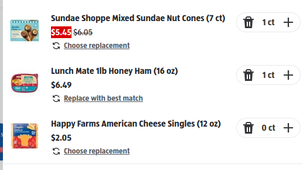

# Addig zero quantity is possible

## Steps to reproduce

1. Open the aldi.us website
2. In the searchbar search for 'Cheese'
3. Select 'Happy Farms American Cheese Singles'
4. Click on in Quantity dropdown
5. Select 'Custom amount'
6. Enter 0
7. Click on 'Add to Cart'

## Actual Result

- The item is added to the basket
- Opening the basket shows the item with 0 amount

## Expected Result
- The item cannot be added to the Cart, because 'Add to Cart' button is disabled

## Screenshot

## Logs
- No error is present in the  `/graphql?operationName=UpdateCartItemsMutation` POST request, returns 200

## Environment
- aldi.us test environment

## Version
- 2.0.3